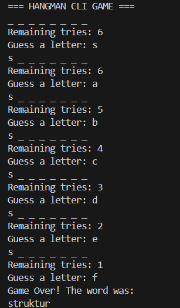

#  Hangman CLI Game (Implementasi Struktur Data  dalam C#)

## Ringkasan Proyek

Aplikasi **Hangman CLI Game** merupakan implementasi permainan tebak kata klasik yang dijalankan melalui antarmuka command line (Command Line Interface). Proyek ini dikembangkan sebagai bagian dari tugas akhir mata kuliah **Struktur Data**, dengan tujuan utama untuk menerapkan konsep **struktur data dasar secara manual** tanpa menggunakan koleksi bawaan C# seperti `List`, `HashSet`, atau sejenisnya.

---

## Tampilan Permainan (I/O dan Screenshot)

**Win UI**


**Game Over UI**




##  Struktur Data yang Diimplementasikan

### 1. `Array` – Representasi Array Karakter Kustom

- **Tujuan Penggunaan:**  
  Menyimpan kata yang harus ditebak oleh pemain serta menampilkan status tebakan (misalnya: `_ _ a _ _`).
  
- **Operasi yang Diimplementasikan:**
  - `Get(int index)` – Mengambil karakter pada indeks tertentu.
  - `Set(int index, char value)` – Mengubah karakter pada indeks tertentu.
  - `Length()` – Mengembalikan panjang array.
  - `Contains(char c)` – Mengecek apakah karakter terdapat dalam array.
  - `Display()` – Menampilkan isi array dengan format yang rapi.

### 2. `GuessedLetter` – Representasi Set Huruf dengan Array Boolean

- **Tujuan Penggunaan:**  
  Melacak huruf-huruf yang telah ditebak agar tidak terjadi pengulangan dan mempermudah validasi input.
  
- **Implementasi:**
  - Menggunakan array `bool[26]` yang merepresentasikan huruf `'a'` hingga `'z'`.
  - `Add(char c)` – Menandai bahwa huruf telah ditebak.
  - `Has(char c)` – Memeriksa apakah huruf sudah pernah ditebak sebelumnya.

  ## 3. Proses Hashing pada `Array`

Struktur data `Array` dalam proyek ini menggunakan pendekatan **hashing langsung (direct hashing)** untuk menyimpan dan memeriksa huruf-huruf yang telah ditebak pemain.

###  Hashing

Huruf-huruf alfabet dari `'a'` hingga `'z'` dipetakan ke dalam indeks array boolean berukuran 26. Proses hashing dilakukan dengan rumus:

```csharp
int index = c - 'a';

- **Penjelasan**
Karakter 'a' memiliki nilai ASCII 97, sehingga c - 'a' akan menghasilkan 0.

'b' → 1, 'c' → 2, ..., 'z' → 25.

Array boolean [false, false, ..., false] akan menandai indeks sebagai true ketika huruf tersebut sudah ditebak.
```

---

### Alur Eksekusi Program

1. Program dimulai dari kelas `Program`, yang membuat objek `WordBank` untuk memilih kata secara acak.
2. Kata diproses ke dalam kelas `HangmanGame`.
3. Kelas `HangmanGame` menginisialisasi:
   - `wordArray` – Menyimpan kata asli.
   - `displayArray` – Menampilkan tebakan saat ini dengan garis bawah.
   - `guessedLetters` – Menyimpan huruf-huruf yang sudah ditebak.
4. Game berjalan dalam loop:
   - Menampilkan tebakan terkini.
   - Meminta pemain menebak satu huruf.
   - Mengecek apakah huruf sudah ditebak (`GuessedLetter`).
   - Jika belum:
     - Cek apakah huruf terdapat di dalam `wordArray`.
     - Jika ya, tampilkan pada posisi yang benar.
     - Jika tidak, kurangi kesempatan.
5. Permainan berakhir ketika:
   - Pemain berhasil menebak seluruh huruf (menang).
   - Pemain kehabisan kesempatan (kalah).

---
## Cara Menjalankan

1. Pastikan sudah menginstal .NET SDK.
2. Buka terminal, lalu jalankan:

```csharp

bash
Copy
Edit
dotnet new console -n HangmanCLI
cd HangmanCLI
# Salin semua file .cs ke dalam folder ini
dotnet run
```
---

## Struktur file

```bash
HangmanCLI/
├── Program.cs          # Titik masuk program
├── WordBank.cs         # Menyediakan kata acak
├── HangmanGame.cs      # Logika utama permainan
├── Array.cs            # Struktur array manual
├── GuessedLetter.cs    # Struktur set boolean
└── README.md           # Dokumentasi proyek
